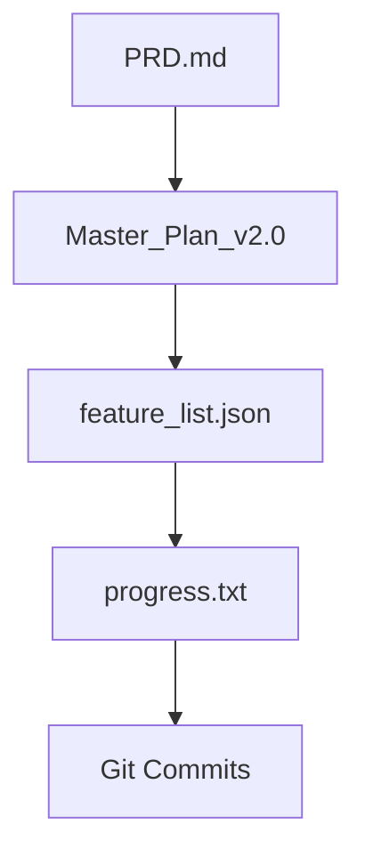

# Anthropic Long-Running Agent Methodology Guide

**Local Finder X Development Standard**

---

## 1. 개요

Anthropic의 "Effective Harnesses for Long-Running Agents" 방법론을 Local Finder X 개발에 적용한 가이드입니다.

---

## 2. 핵심 원칙

### 2.1 Session-Based Incremental Development
- **세션당 2-3개 Feature 구현**
- 각 세션은 독립적으로 커밋 가능한 단위
- 세션 종료 시 반드시 `progress.txt` 업데이트

### 2.2 Progress Artifacts
| 파일 | 용도 |
|------|------|
| `init.sh` | 환경 초기화 스크립트 |
| `progress.txt` | 세션별 진행 로그 |
| `feature_list.json` | Feature 목록 및 통과 상태 |

### 2.3 Feature Lifecycle
```
[ ] 미구현 → [/] 진행중 → [x] 완료
      ↓           ↓           ↓
   passes:     passes:     passes:
    false       false        true
```

---

## 3. 세션 워크플로우

### 3.1 세션 시작
```bash
# 1. 환경 확인
source init.sh

# 2. 이전 세션 리뷰
cat progress.txt | tail -50

# 3. 다음 Feature 확인
cat feature_list.json | jq '.[] | select(.passes == false) | .id' | head -3
```

### 3.2 구현 단계
1. **Feature 코드 작성**
2. **Import/기본 테스트 실행**
3. **feature_list.json 업데이트** (`passes: true`)
4. **Git 커밋**

### 3.3 세션 종료
```bash
# progress.txt 업데이트
echo "## [$(date +%Y-%m-%d)] Coding Session N" >> progress.txt
echo "- [COMPLETED] FXXX: Description" >> progress.txt

# Git 커밋
git add -A && git commit -m "feat: Summary of session work"
```

---

## 4. 파일 규칙

### 4.1 progress.txt 형식
```markdown
## [YYYY-MM-DD] Coding Session N
- [COMPLETED] F0XX: Feature Name (`path/to/file.py`)
  - Implementation detail 1
  - Implementation detail 2
  - Test result ✅

## Next Session TODO
- [ ] F0XX: Next feature
```

### 4.2 feature_list.json 형식
```json
{
    "id": "F001",
    "sprint": 1,
    "pr": "PR#1",
    "category": "storage",
    "description": "Feature Name",
    "steps": ["step1", "step2"],
    "passes": false
}
```

---

## 5. 커밋 규칙

### 5.1 커밋 메시지 형식
```
feat: FXXX (Feature Name) + FYYY (Feature Name)

Sprint N: Category Name
- Implemented src/path/to/file.py
  - Detail 1
  - Detail 2
```

### 5.2 Sprint 단위 커밋
- Sprint 내 2-3개 Feature를 하나의 커밋으로
- 각 Feature는 독립적으로 테스트 가능해야 함

---

## 6. 테스트 기준

### 6.1 Feature 통과 조건 (passes: true)
- [ ] Import 성공
- [ ] 기본 인스턴스 생성 가능
- [ ] 핵심 기능 1개 이상 동작 확인

### 6.2 Sprint 완료 조건
- [ ] 모든 Feature `passes: true`
- [ ] Git 커밋 완료
- [ ] progress.txt 업데이트

---

## 7. 스프린트 목록

| Sprint | 영역 | Features | 상태 |
|--------|------|----------|------|
| 1 | Storage Layer | F001-F006 | ✅ |
| 2 | Indexing Core | F007-F012 | ✅ |
| 3 | Search Engine | F013-F019 | ✅ |
| 4 | UI | F020-F027 | ✅ |
| 5 | Pro Features | F028-F032 | ✅ |
| 6 | Packaging | F033-F034 | ✅ |
| 7 | UI Enhancement | F035-F038 | 🔜 |

---

## 8. 문서 의존성



---

## 9. 에이전트 프롬프팅 규칙

1. **세션 시작 시**: "다음 Feature 확인 후 구현"
2. **세션 중**: "테스트 후 passes 업데이트"
3. **세션 종료 시**: "progress.txt 업데이트 후 커밋"
4. **에러 발생 시**: "progress.txt에 에러 기록 후 재시도"

---

## 10. 현재 상태 (2025-12-13)

- **완료**: 34/38 Features (89%)
- **다음**: Sprint 7 UI Enhancement (F035-F038)
- **목표**: Indexing Page 폴더 트리 + 메타데이터 필터
